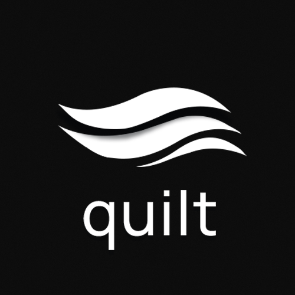

<p align="center">
  
</p>

## quilt

quilt is a focused automation workspace for X. it brings follow, unfollow, like, and unlike workflows into a controlled, task-based interface with human-tuned timing, session safety, and a clean side panel experience.

## features

- **follow / unfollow** — direct API-based actions with verification, scoped to your following list
- **like / unlike** — GraphQL-driven with custom heart animation and feed scrolling
- **search builder** — advanced X search with saved queries, categories, sliding time windows, and 10 pre-loaded templates
- **side panel** — persistent workspace with live progress tracking, timer, and task controls
- **session safety** — adaptive delays, cooldowns, rate limiting, and fatigue breaks
- **pro tier** — optional upgrade via LemonSqueezy for higher limits (free tier: 50 follows per run, 200 likes per day)

## install (developer)

```
npm install
npm run build
```

then load the `extension/` folder as an unpacked extension in `chrome://extensions` with developer mode enabled.

## build

| command | what it does |
|---------|-------------|
| `npm run build` | bundles Material Web + fonts into minified popup and sidepanel bundles |
| `npm run watch` | same as build, with file watching for development |
| `npm run sync-version` | copies `package.json` version into `manifest.json` |

## release

```
npm run build
npm run sync-version
```

then zip the `extension/` folder and upload to the Chrome Web Store.

## privacy

quilt stores all data locally in `chrome.storage.local`. no analytics, no telemetry, no external data collection. license validation uses LemonSqueezy's API with only a license key and random device ID.

full privacy policy: [lithe.pw/quilt/privacy](https://lithe.pw/quilt/privacy)
